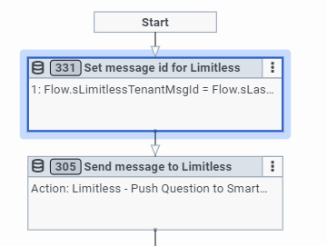

## Introduction
This Genesys Cloud Developer blueprint explains how to connect Genesys Cloud to the Limitless GigCX SmartCrowd platform.

The SmartCrowd platform is a fully managed service comprised of experts who are available 24/7, in any language. Experts are rewarded on a per-task basis, which means they provide support at a significantly lower cost than traditional cost centers.

This blueprint shows you how to connect to the SmartCrowd platform and configure how tasks should be routed. After you do this, you can use GigCx to quickly build a qualified crowd of expert product users that can help your existing contact center staff resolve customer support tickets.

For more information about Limitless and GigCX, see [https://www.limitlesstech.com/](https://www.limitlesstech.com/ "Goes to the Limitless website").

## Solution

To receive and route support requests to the correct expert in the SmartCrowd platform, Developers use Genesys Cloud Architect flows, open messaging, the webchat channel, and the email channel, as well as the Limitless APIs.

:::tertiary
**NOTE: This link results in a 410 error!!!***
For more information about the partnership between Limitless and Genesys,
see <https://www.limitlesstech.com/genesys/>
:::

## Contents

[toc]

## Obtain required information for Limitless SmartCrowd

To bring experts into conversations with your customers, you must connect Genesys Cloud to Limitless SmartCrowd. The expert crowd uses the SmartCrowd platform to receive conversations and respond to them via the web or via the Limitless Mobile App.

To connect Genesys Cloud to Limitless SmartCrowd:

1. [Contact Limitless](https://www.limitlesstech.com/request-a-demo/ "Goes to the page where you can book a Limitless GigCX demo") and obtain the following information:
   * Your API key (x-api-key)
   * Your group name  
   * Your user credentials so you can play the role of an expert in your group on the SmartCrowd platform

## Prepare the data actions

You use data actions to call the Limitless APIs and pass the API key and group name to SmartCrowd. This enables you to submit questions and customer dialogues to Limitless.

1. Install and activate the Web Services Data Actions integration and the Genesys Cloud data actions. For more information, see [About the web services data action](https://help.mypurecloud.com/?p=127163 "Goes to the About the web services data action article in the Genesys Cloud Resource Center").

2. From the Data Actions folder, import all 12 of the data actions provided with this blueprint. For more information on how to import data actions, see [Import or export a data action for integrations](https://help.mypurecloud.com/?p=161024 "Goes to the Import or export a data action for integrations article in the Genesys Cloud Resource Center"). For more details about the specific data actions provided, see the [Data actions reference table](#data-action-reference-table "Goes to the Data action reference table section").

3. For each data action, be sure to click **Save and publish**, so that they can be used in our Architect flows.

### Data action reference table

Each data action connects to an API. Some are Genesys Cloud APIs and some are Limitless Web Services as shown in the following table.

|**Data action name**|**Integration**|**Genesys Cloud API**|**Used in**|**Purpose**|
| :-: | :-: | :-: | :-: | :-: |
|Limitless - Get Contact By Phone from Genesys Cloudv1|Genesys Cloud|/api/v2/externalcontacts/contacts?q=${input.phone}|- Open messaging flow|Looks up the Customer in the Genesys CloudExternal Contacts using the phone number. Returns the customer's first name and the first initial of their last name, which are used for personalization of responses. **Note**: If you use a CRM for this type of customer information, then use your CRM API to get these details. |
|Limitless - Get Message Id Count from Genesys Cloudv1|Genesys Cloud|/api/v2/conversations/messages/${input.conversationId}|- Open messaging flow- Chat flow|Counts the number of messages authored by the customer for this Genesys Cloud conversation. This is used to send additional customer dialogs to Limitless|
|Limitless - Get Last N Message Ids from Genesys Cloudv1|Genesys Cloud|/api/v2/conversations/messages/${input.conversationId}|- Open messaging flow|Returns the last N message Ids of messages authored by the customer during this Genesys Cloud conversation. This is used to send additional customer dialogs to Limitless|
|Limitless - Get Last Message from Genesys Cloudv1|Genesys Cloud|/api/v2/conversations/messages/${input.conversationId}/messages/${input.messageId}|- Open messaging flow|Returns the customer-authored portion of a dialog (the message body) for a specific message record so it can be sent to Limitless.|
|Limitless - Get Message Ids From Chat Conv By Id from Genesys Cloudv1|Genesys Cloud|/api/v2/conversations/chats/${input.conversationId}/messages?sortOrder=${input.sortOrder}|- Chat flow|Gets any new message Ids from the chat, oldest first.|
|Limitless - Get Message Ids From Chat Conv By Id And MsgId from Genesys Cloudv1|Genesys Cloud|/api/v2/conversations/chats/${input.conversationId}/messages?after=${input.messageId}&sortOrder=${input.sortOrder}|- Chat flow|Additionally searches with messageId/api/v2/conversations/chats/${input.conversationId}/messages?sortOrder=${input.sortOrder}vs./api/v2/conversations/chats/${input.conversationId}/messages?after=${input.messageId}&sortOrder=${input.sortOrder}.
|Limitless - Push Question to SmartCrowd v1|Web Services|N/A| - Open messaging flow - Email flow- Chat flow |Submits the question/conversation to Limitless.|
|Limitless - Submit FollowUp Dialogue to SmartCrowd v1|Web Services|N/A| - Open messaging flow - Email Flow - Chat flow |Submits new customer-authored dialogs to Limitless.|
|Limitless - Return from SmartCrowd v1|Web Services|N/A| - Open messaging flow - Chat flow |Tells SmartCrowd to close its message lifecycle because Genesys Cloud has brought an agent into the conversation.|
|Limitless - Get Full Event from SmartCrowd v1|Web Services|N/A| - Open messaging flow - Email flow - Chat flow
|Retrieves Expert Dialogue and SmartCrowd Message Status events from the Limitless event queue.|
|Limitless Send Email Reply v1|Web Services|N/A|- Email flow|Sends the Expert response via email using an SMTP server.|
|Limitless - Shorten Link v1|Web Services|N/A| - Open messaging flow - Email flow - Chat flow |Calls a third-party URL shortener, such as [Bitly](https://bitly.com/ "Goes to the Bitly website"), to reduce the size of the CSAT link. **Note**:You can also replace Bitly with your URL shortener of choice. To use Bitly, you will need a Bitly account and you will need to put your account-specific token into the header. |
{: class="table-striped table-bordered"}

## Import the Architect flows

In this solution, Architect flows handle the following tasks:

- Route conversations to Expert Crowd
- Integrate between Genesys Cloud and the Limitless SmartCrowd platform
- Facilitate the conversation between a customer and a GigCX Expert
- Manage the lifecycle/status events coming from the SmartCrowd platform and routes accordingly within Genesys Cloud
- Bring a Genesys Cloud agent into the conversation if the Expert Crowd is unable to help the customer

To build this solution, you need to import these Architect flows:

- **Open messaging** - Connect Limitless to your open messaging channels
- **Chat** - Connect Limitless to your web chat channels. **Note**: This flow is compatible with web chat v1.1 and web chat v2.
- **Email** - Connect Limitless to your email channels.

For information about how to import Architect flows, see [Import or export a flow](https://help.mypurecloud.com/?p=2730 "Goes to the Import or export a flow article in the Genesys Cloud Resource Center").

### Set the flow variables

For each Architect flow, set the necessary flow variables.

1. In Architect, edit the Architect flow.
2. In the ***Resources>Data*** area of each flow, set the following variables.

  |Variable|Set to|
  | :-: | :-: |
  |Flow.apikey|Your API key that Limitless provided|
  |Flow.stage|The target Limitless environment that Limitless provided|
  |Flow.EnterpriseName|The name of your enterprise. This value will appear in some of the Send Response blocks within the Architect flow.|
  |Flow.GroupName|The group name that Limitless provided|
  |Flow.LoopMax|The maximum number of loops you want the Architect flow to go through (See ‘Enter The Loop’ section). The default value is 90. Change this only after you consult the Limitless team.|
  |Flow.WaitSeconds|The required wait time for the loop (See ‘Enter The Loop’ section). The default value is 8 seconds. Change this only after you consult the Limitless team.|
  {: class="table-striped table-bordered"}

For more information about managing variables, see [Manage a variable](https://help.mypurecloud.com/?p=109357 "Opens the Manage a variable article in the Genesys Cloud Resource Center").

### Connect Limitless to your Genesys Cloud open messaging channel

To connect Limitless to your open messaging channel, use the Open messaging flow.

***QUESTION***: I don't see an open messaging flow in the Architect Flows folder of this blueprint solution.

### Flow states

Each flow has two states:

- **Starting State** - The Starting State represents a very simple flow that engages Limitless GigCX by calling the Limitless Expert state. Other than for demos you probably won’t use this “Starting State” as you will have your own flows that you wish to extend to the Expert Crowd.
- **Limitless Expert** - This state contains the connectivity and conversation lifecycle management logic when the conversation is being handled by Expert Crowd via the SmartCrowd platform. The logic contained in this state is described in more detail below, but you should make changes here only in consultation with the Limitless team. This state has been designed so that you can simply drop it into your existing Genesys Cloud flows and bring the Expert Crowd into conversations when you wish.

#### Starting state

The Starting state contains:

- ***A Send Response Block*** - This contains debugging information that confirms you are in the Limitless Demo and the Genesys Cloud Message ID
- ***Switch Block***:
  - Case 1 - Shows how to route messages straight to a Genesys Cloud agent rather than the GigCX Crowd
  - Case 2 - Shows where you could use automation or a chatbot  
  - Case 3 - Shows where you could route to Limitless via the **Limitless Expert** state

#### Limitless Expert State

This state contains the connectivity and conversation lifecycle management when the conversation is being handled by Expert Crowd via the SmartCrowd platform.

##### Look up the customer

The very first step in our "Limitless Expert" flow is a Call Data Action using the ‘Get Contact By Phone' action.

This block uses the Customer’s phone number to retrieve Customer First Name and first initial of Last Name to include in the post of the question to Limitless. The Customer First Name and First Initial of their Last Name are shared and can be seen by the Expert Crowd to aid the personalisation of the Expert response. In your contact center you may be using a Customer Relationship Management (CRM) solution and you can replace this Data Action with a call to your CRM to retrieve the needed customer information.

***An important note here on ‘Transfer to ACD’ blocks in the flow*** - You can see that exception handling throughout the flow sends the conversation to an ‘Escalated’ queue via a ‘Transfer to ACD’ block. This ‘Escalated’ queue should be replaced with the Agent queue that you want conversations to go if the ‘Limitless Expert' state hits a problem or if the Expert Crowd are unable to help the customer.

##### Submit the Question to Limitless
Next, we have another Call Data Action using the ‘Limitless Push Question’ action. This submits the Customer’s question to the Limitless SmartCrowd platform, and it becomes visible to Experts in the GigCX Crowd. In the integration the Genesys CloudConversation ID and Limitless Message ID are exchanged.

##### Enter The Loop
After successfully submitting the customer question to Limitless the ‘Limitless Expert’ flow prepares to enter a loop. The Loop itself performs two functions:

1. To monitor the customer side of the conversation - detecting and submitting additional Customer dialogues to Limitless.
1. To monitor the Limitless side of the conversation - detecting and displaying Expert dialogues to the Customer and monitoring the Lifecycle state of the Limitless message within the SmartCrowd platform and taking appropriate action based on these statuses.

By default, the Loop will execute 90 times with a wait time of 8 seconds. These values can be changed to adjust the customer experience in different messaging channels and scenarios - consider changing these values only in consultation with the Limitless Team.

To prepare for entering the loop the flow does the following:

1. Attaches the Limitless Message ID to the Conversation - This is used to signify that a conversation is ‘with Limitless’ and this association is removed later in the flow when the Limitless portion of the conversation is over.
1. Sets the Customer Message Count to 1, signifying that the question has been submitted to Limitless. This value is used within the loop to decide if additional customer dialogues need to be sent to Limitless.

##### The Loop

At the start of each loop the number of customer dialogues on the conversation is compared with the previous number at the start of the last loop. This is done by the Action: Get Message ID Count and the subsequent Decision block.

If the number is now greater than the saved number, the loop moves to the Customer Dialogue part of the loop to pick up and send to Limitless the additional customer dialogues.

If the number is not greater than the saved number, the loop moves to the Limitless part of the loop to pick up and send Expert dialogues and monitor the status of the message within SmartCrowd so appropriate actions can be taken within the conversation.

If neither the customer nor the expert present dialogue, then the Wait block is executed. This Wait keeps the loop from “running away” and reaching the LoopMax count too quickly. A smaller value in the WaitSeconds flow variable can make the whole experience feel more responsive. However, too small of a WaitSeconds value will cause the entire loop to complete too soon. Again, please consult with the Limitless team before you alter these default values.

##### Customer Dialog Side of the Loop

This part of the Loop picks up additional Customer dialogues to send to Limitless. It picks up the number of Customer dialogues that have been authored since the last send to Limitless and then loops through them, submitting each one to Limitless via the ‘Limitless Submit Follow Up Dialogue’ Data Action.

If the customer at any point includes the word “Agent” then the loop uses an ‘Transfer to ACD” block to immediately bring in an Agent. You would consider the logic you want here, if any. If this ‘Transfer to ACD’ block is triggered, and the Agent is brought into the conversation then the Flow informs Limitless SmartCrowd via the 'Limitless Return’ Data Action. This is to ensure the conversation gets closed on the Limitless side and removed from Experts.

##### Limitless Side of the Loop

This part of the Loop monitors a Limitless Event queue for Expert dialogues and Limitless status events that need to trigger specific actions in the conversation. This part of the Loop starts with retrieving the events from the queue via the ‘Limitless Get Full Event Prod’ Data Action.

The subsequent Event Type block then evaluates the following cases:

- ***Case 1*** - An Expert dialogue event is detected via the Limitless update type = ‘dlg’. The Expert dialogue is sent to the Customer via a Send Response block

- ***Case 2*** - The Expert has expressed an opinion that they believe the conversation to have been completed and this event is detected via the Limitless update type = ‘cust\_confirmation’. If a CSAT hasn’t already been sent then this event triggers a CSAT link (shortened via a Data Action) to be sent to the Customer.

- ***Case 3*** - A Limitless SmartCrowd status change event is detected via the Limitless update type = ‘state’. These status changes are further evaluated, and the following actions performed:
  - ***‘Escalated’*** - The Expert Crowd have decided they cannot resolve this question. When this state is detected, the Customer receives a message stating that an Agent will be brought into the conversation and a ‘Transfer to ACD’ block is used to bring in the Agent.
  - ***‘TimedOut’*** - The Expert Crowd did not respond in time. When this state is detected, the Customer receives a message stating that an Agent will be brought into the conversation and a ‘Transfer to ACD’ block is used to bring in the Agent.
  - ***‘Open’ & Not ‘TimedOut’*** - The Limitless lifecycle is in a state where a CSAT, if not already issued, should be sent to the Customer. The flow actions this.
  - ***‘Resolved’*** - The Limitless lifecycle has completed and the question was resolved. This is an end state and the flow disconnects.

### The chat flow

Use this to connect Limitless to your web chat channels (note: This flow is compatible with web chat v1.1 & web chat v2)

#### Starting state

This state begins by welcoming the customer and checking there is a customer message to respond to.

Once this has been established then the customers chat is routed to Limitless via a switch block:

- Case 1 - Showing example routing straight to an Agent rather than the GigCX Crowd
- Case 2 - Showing an example where automation/chatbot could be used
- Case 3 - Showing example routing to Limitless via the ‘Limitless Expert’ state

#### Limitless Expert State

This state contains the connectivity and conversation lifecycle management when the conversation is being handled by Expert Crowd via the SmartCrowd platform.

#### Submit the Question to Limitless

First, we have a Call Data Action using the ‘Limitless Push Question’ action. This submits the Customer’s question to the Limitless SmartCrowd platform, and it becomes visible to Experts in the GigCX Crowd. In the integration the Genesys CloudConversation ID and Limitless Message ID are exchanged.

#### Enter The Loop

After successfully submitting the customer question to Limitless the ‘Limitless Expert’ flow prepares to enter a loop. The Loop itself performs two functions:

1. To monitor the customer side of the conversation - detecting and submitting additional Customer dialogues to Limitless.
1. To monitor the Limitless side of the conversation - detecting and displaying Expert dialogues to the Customer and monitoring the Lifecycle state of the Limitless message within the SmartCrowd platform and taking appropriate action based on these statuses.

By default, the Loop will execute 90 times with a wait time of 8 seconds. These values can be changed to adjust the customer experience in different messaging channels and scenarios - consider changing these values only in consultation with the Limitless Team.

To prepare for entering the loop the flow does the following:

1. Attaches the Limitless Message ID to the Conversation - This is used to signify that a conversation is ‘with Limitless’ and this association is removed later in the flow when the Limitless portion of the conversation is over.
1. Sets the Customer Message Count to 1, signifying that the question has been submitted to Limitless. This value is used within the loop to decide if additional customer dialogues need to be sent to Limitless.

#### The Loop

At the start of each loop the number of customer dialogues on the conversation is compared with the previous number at the start of the last loop. This is done by the Action: Get Message ID Count and the subsequent Decision block.

If the number is now greater than the saved number, the loop moves to the Customer Dialogue part of the loop to pick up and send to Limitless the additional customer dialogues.

If the number is not greater than the saved number, the loop moves to the Limitless part of the loop to pick up and send Expert dialogues and monitor the status of the message within SmartCrowd so appropriate actions can be taken within the conversation.

If neither the customer nor the expert present dialogue, then the Wait block is executed.  This Wait keeps the loop from “running away” and reaching the LoopMax count too quickly. A smaller value in the WaitSeconds flow variable can make the whole experience feel more responsive.  However, too small of a WaitSeconds value will cause the entire loop to complete too soon.  Again, please consult with the Limitless team before you alter these default values.

##### Customer Dialog Side of the Loop

This part of the Loop picks up additional Customer dialogues to send to Limitless. It picks up the number of Customer dialogues that have been authored since the last send to Limitless and then loops through them, submitting each one to Limitless via the ‘Limitless Submit Follow Up Dialogue’ Data Action.

If the customer at any point includes the word “Agent” then the loop uses an ‘Transfer to ACD” block to immediately bring in an Agent. You would consider the logic you want here, if any. If this ‘Transfer to ACD’ block is triggered, and the Agent is brought into the conversation then the Flow informs Limitless SmartCrowd via the 'Limitless Return’ Data Action. This is to ensure the conversation gets closed on the Limitless side and removed from Experts.

##### Limitless Side of the Loop

This part of the Loop monitors a Limitless Event queue for Expert dialogues and Limitless status events that need to trigger specific actions in the conversation. This part of the Loop starts with retrieving the events from the queue via the ‘Limitless Get Full Event Prod’ Data Action.

The subsequent Event Type block then evaluates the following cases:

- ***Case 1*** - An Expert dialogue event is detected via the Limitless update type = ‘dlg’. The Expert dialogue is sent to the Customer via a Send Response block

- ***Case 2*** - The Expert has expressed an opinion that they believe the conversation to have been completed and this event is detected via the Limitless update type = ‘cust\_confirmation’. If a CSAT hasn’t already been sent then this event triggers a CSAT link (shortened via a Data Action) to be sent to the Customer.

- ***Case 3*** - A Limitless SmartCrowd status change event is detected via the Limitless update type = ‘state’. These status changes are further evaluated, and the following actions performed:
  - ***‘Escalated’*** - The Expert Crowd have decided they cannot resolve this question. When this state is detected, the Customer receives a message stating that an Agent will be brought into the conversation and a ‘Transfer to ACD’ block is used to bring in the Agent.
  - ***‘TimedOut’*** - The Expert Crowd did not respond in time. When this state is detected, the Customer receives a message stating that an Agent will be brought into the conversation and a ‘Transfer to ACD’ block is used to bring in the Agent.
  - ***‘Open’ & Not ‘TimedOut’*** - The Limitless lifecycle is in a state where a CSAT, if not already issued, should be sent to the Customer. The flow actions this.
  - ***‘Resolved’*** - The Limitless lifecycle has completed and the question was resolved. This is an end state and the flow disconnects.

### The email flow

Use this to connect Limitless to your email channels

#### Starting State

This state contains:

- ***A Send Response Block*** - This contains debugging information that confirms you are in the Limitless Demo and the Genesys CloudMessage ID
- ***Switch***:
  - ***Case 1*** - Showing routing straight to an Agent rather than the GigCX Crowd
  - ***Case 2*** - Showing where automation/chatbot could be used (Self help)
  - ***Case 3*** - Sends a follow-up message to Limitless via the Data action (customer replies to the thread)

- ***Default*** - Routing the original question to the expert. This part of the flow contains a Call Data Action using the ‘Limitless Push Question’ action. This submits the Customer’s question to the Limitless SmartCrowd platform, and it becomes visible to Experts in the GigCX Crowd. In the integration the Genesys CloudConversation ID and Limitless Message ID are exchanged.

#### Limitless Expert State

This state contains the connectivity and conversation lifecycle management when the conversation is being handled by Expert Crowd via the SmartCrowd platform.

#### Enter The Loop

After successfully submitting the customer question to Limitless the ‘Limitless Expert’ flow prepares to enter a loop. The Loop itself performs one function, to monitor the Limitless side of the conversation - detecting and displaying Expert dialogues to the Customer and monitoring the Lifecycle state of the Limitless message within the SmartCrowd platform and taking appropriate action based on these statuses.

By default, the Loop will execute 90 times with a wait time of 8 seconds. These values can be changed to adjust the customer experience in different Email channels and scenarios - consider changing these values only in consultation with the Limitless Team.

To prepare for entering the loop the flow attaches the Limitless Message ID to the Conversation - This is used to signify that a conversation is ‘with Limitless’ and this association is removed later in the flow when the Limitless portion of the conversation is over.

#### The Loop

The loop picks up and sends Expert dialogues and also monitors the status of the message within SmartCrowd so appropriate actions can be taken within the conversation.

If the expert presents a dialogue, then the Wait block is executed. This Wait keeps the loop from “running away” and reaching the LoopMax count too quickly. A smaller value in the WaitSeconds flow variable can make the whole experience feel more responsive. However, too small of a WaitSeconds value will cause the entire loop to complete too soon. Again, please consult with the Limitless team before you alter these default values.

##### Monitoring Limitless

This part of the Loop monitors a Limitless Event queue for Expert dialogues and Limitless status events that need to trigger specific actions in the conversation. This part of the Loop starts with retrieving the events from the queue via the ‘Limitless Get Full Event Prod’ Data Action. The subsequent Event Type block then evaluates the following cases:

- ***Case 1*** - An Expert dialogue event is detected via the Limitless update type = ‘dlg’. The Expert dialogue is sent to the Customer via a Send Response block

- ***Case 2*** - The Expert has expressed an opinion that they believe the conversation to have been completed and this event is detected via the Limitless update type = ‘cust\_confirmation’. If a CSAT hasn’t already been sent then this event triggers a CSAT link (shortened via a Data Action) to be sent to the Customer.

- ***Case 3*** - A Limitless SmartCrowd status change event is detected via the Limitless update type = ‘state’. These status changes are further evaluated, and the following actions performed:
  - ***‘Escalated’*** - The Expert Crowd have decided they cannot resolve this question. When this state is detected, the Customer receives a message stating that an Agent will be brought into the conversation and a ‘Transfer to ACD’ block is used to bring in the Agent.
  - ***‘TimedOut’*** - The Expert Crowd did not respond in time. When this state is detected, the Customer receives a message stating that an Agent will be brought into the conversation and a ‘Transfer to ACD’ block is used to bring in the Agent.
  - ***‘Open’ & Not ‘TimedOut’*** - The Limitless lifecycle is in a state where a CSAT, if not already issued, should be sent to the Customer. The flow actions this.
  - ***‘Resolved’*** - The Limitless lifecycle has completed and the question was resolved. This is an end state and the flow disconnects.

## Cloud Analytics and Reporting

The use of the Limitless flows has no impact on Cloud Analytics or Genesys Cloud reporting.

## Other Considerations

- ***Flow Outcomes*** - The blueprint does not contain Flow Outcomes to avoid validation errors on import. You should consider what Flow Outcomes you want and introduce these to Flow.

## Additional Resources

[Genesys Cloud APIs](/api/ "Goes to the APIs page")
